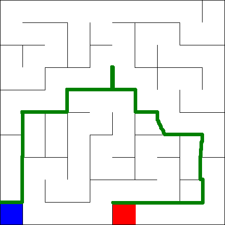
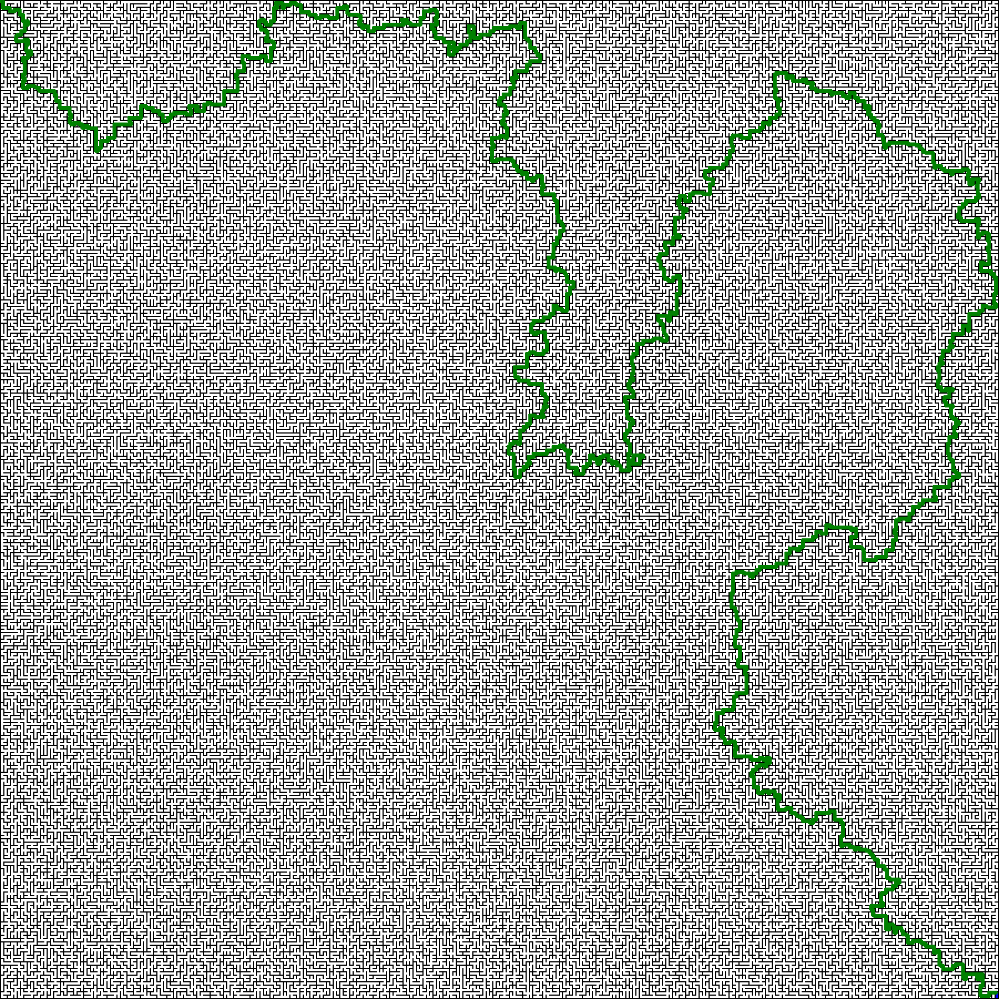
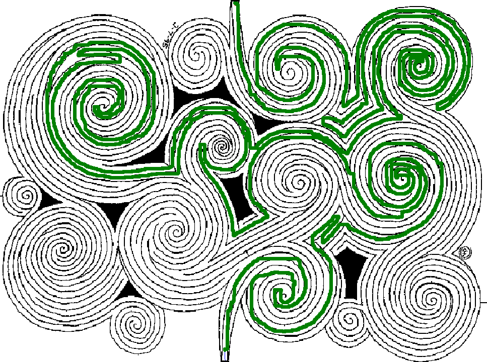

# SolveMaze

## Challenge
This coding challenge is part of the interview process for the Mobile Developer role at UNNAMED COMPANY in Los Angeles. The goal of the challenge is to write a command line program in C# to solve a maze. The maze is represented in the form of a .png image, with the walls in back, start in red and finish in blue. The solution is drawn in green. 



## Implementation
When I first saw the problem, I immediately thought of the path-finding problem in video game AI. And I recalled A-Star search Algorithm as being one of the most widely used solution. So I googled "A-Star Algorithm" and found the Wikipedia page with pseudocode (https://en.wikipedia.org/wiki/A*_search_algorithm). Then I went about implementing it on my own.

To run the program, you will need the source image name and destionation image name as arguments.
```
maze.exe source.[bmp,png,jpg] destination.[bmp,png,jpg]
```

## Result
The solution works with very complex maze. 

The solution works even when the maze is not orthogonal.

