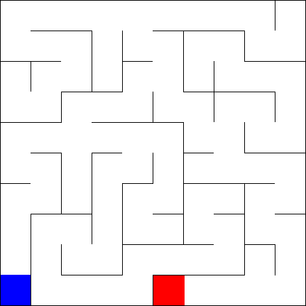

# SolveMaze

## Challenge
This coding challenge is part of the interview process for the Mobile Developer role at UNNAMED COMPANY in Los Angeles. The goal of the challenge is to write a command line program in C# to solve a maze. The maze is represented in the form of a .png image, with the walls in back, start in red and finish in blue. The solution is drown in green. 

